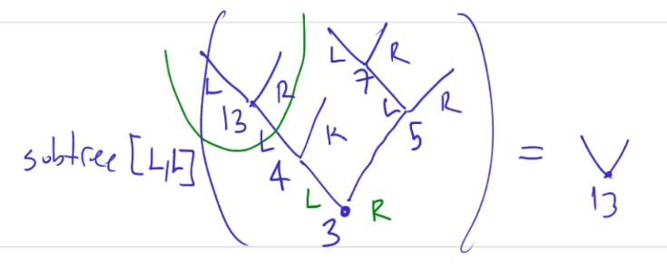
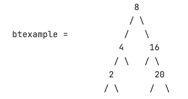
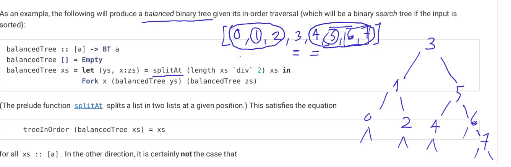
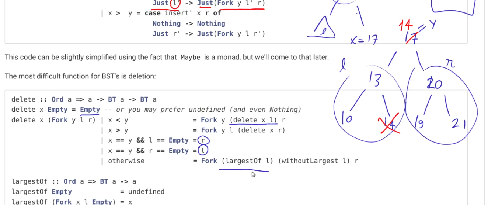

### Binary Trees

- A ```binary tree``` over elements of a type ```a``` is either ```empty```, or consists of a root labelled by an element of the type ```a``` followed by ```two binary trees,``` called the ```left``` and ```right subtrees:```
```haskell
data BT a = Empty | Fork a (BT a) (BT a)
```
- Similarly...```Fork``` has the same definition of a ```Node```.
```haskell
data Tree a = Leaf a | Node (Tree a) a (Tree a)
```
- ```Fork x l r``` is defined as
- - Given two trees ```l``` and ```r``` and an element ```x::a```
```haskell
    x
   / \
  /   \
 l     r
```

- For example, the tree

```haskell
      8
     / \
    /   \
   4     16
  / \   / \
 2        20
/ \      /  \
```

- is written as

```haskell
t :: BT Int
t = Fork 8 (Fork 4 (Fork 2 Empty Empty) Empty) (Fork 16 Empty (Fork 20 Empty Empty))
```

### Mirror Binary Tree

- To get started, let's ```mirror trees```, so that e.g. from the above we get

```haskell
      8
     / \
    /   \
   16     4
  / \   / \
 20        2
/ \      /  \
```

- Here is a ```mirror``` function:

```haskell
mirror :: BT a -> BT a
mirror Empty = Empty
mirror Fork x (l r) = Fork x (mirror r) (mirror l)
```
- Running the ```mirror``` function

```haskell
mirror t = Fork 8 (Fork 4 (Fork 2 Empty Empty) Empty) (Fork 16 Empty (Fork 20 Empty Empty))
```
#### Example

- We define the ```size``` of a tree as its total number of nodes:
```haskell
size :: BT a -> Int
size Empty = 0
size Fork x (l r) = 1 + size(l) + size(r)
```
- We define the ```height``` of a tree to be the length of the longest path from the root, measured in number of nodes:
```haskell
height :: BT a -> Int
height Empty = 0
height Fork x (l r) = 1 + max (height l) (height r)
```

### Tree Traversal
- ```In-Order``` Traversal
    - This function returns a list of values
    - If this list is sorted, then the tree is called a ```search tree.```
```haskell
treeInOrder :: BT a -> [a]
treeInOrder Empty = []
treeInOrder (Fork x l r) = treeInOrder l ++ [x] ++ treeInOrder r
```
- ```Pre-Order``` Traversal
```haskell
treePreOrder :: BT a -> [a]
treePreOrder Empty = []
treePreOrder (Fork x l r) = [x] ++ treePreOrder l ++ treePreOrder r
```
- ```Post-Order``` Traversal
```haskell
treePostOrder :: BT a -> [a]
treePostOrder Empty = []
treePostOrder (Fork x l r) = treePostOrder l ++ treePostOrder r ++ [x]
```

### Directions, addresses and paths in binary trees

- To pick a subtree of a binary tree, we go left or right successively, until we find it.
- An ```address``` is a list of directions. For example ```[L,L,R]```.
```haskell
data Direction = L | R deriving (Show)
type Address = [Direction]
```
- Task: Given an address, return a subtree from a tree.


```haskell
subtree :: Address -> BT a -> Maybe (BT a)
subtree [] t = Just t
subtree (x:xs) Empty = Nothing
subtree (L:ds) (Fork _ l _) = subtree ds l --What matters is the left subtree. We are traversing it.   
subtree (R:ds) (Fork _ _ r) = subtree ds r
```
- Following the above pattern, we can define a function that checks whether an address in a given tree is valid:
```haskell
isValid :: Address -> BT a -> Bool
isValid [] _ = True
isValid (x:xs) Empty = False
isValid (L:ds) (Fork _ l _) = isValid ds l 
isValid (R:ds) (Fork _ _ r) = isValid ds r
```
- The list of all valid addresses for subtrees can be computed as follows:
```haskell
validAddresses' :: BT a -> [Address]
validAddresses' Empty        = [[]]
validAddresses' (Fork _ l r) = [[]] ++ (map (L:) (validAddresses' l)) ++ (map (R:) (validAddresses' r))
````
#### Example
- Let's define a function that decides if a given value occurs in a tree:

```haskell
data Tree a = Leaf a | Node (Tree a) a (Tree a)

t :: Tree Int
t = Node (Node (Leaf 1) 3 (Leaf 4)) 5 (Node (Leaf 6) 7 (Leaf 9))

occurs :: Eq a => a -> Tree a -> Bool
occurs x (Leaf y) = x == y
occurs x (Node l y r ) = x == y || occurs x l || occurs x r
```
- Calling ```occurs 10 t``` returns ```False```
- Calling ```occurs 5 t``` returns ```True```

### Breath-First-Search
- We first write a function that returns the levels of a list


```haskell
btexample = Fork 8 (Fork 4 (Fork 2 Empty Empty) Empty) (Fork 16 Empty (Fork 20 Empty Empty))
```
```haskell
levels :: BT a -> [[a]]
levels Empty        = []
levels (Fork x l r) = [[x]] ++ zipappend (levels l) (levels r)
  where
    zipappend []       yss      = yss
    zipappend xss      []       = xss
    zipappend (xs:xss) (ys:yss) = (xs ++ ys) : zipappend xss yss

ghci> levels btexample
[[8],[4,16],[2,20]]
```
- With this we can define

```haskell
treeBreadthFirst :: BT a -> [a]
treeBreadthFirst = concat . levels

ghci> treeBreadthFirst btexample 
[8,4,16,2,20]
```

### Balanced Binary Tree

- As an example, the following will produce a balanced binary tree given its in-order traversal (which will be a binary search tree if the input is sorted):
```haskell
balancedTree :: [a] -> BT a
balancedTree [] = Empty
balancedTree xs = 
  let (ys, x:zs) = splitAt (length xs `div` 2)xs 
  in Fork x (balancedTree ys)(balancedTree zs)
```
where ```splitAt```
```haskell
splitAt :: Int -> [a] -> ([a], [a])
```
#### Balancing a binary tree...
- To balance a binary tree
```haskell
balance :: BT a -> BT a
balance = balancedTree . treeInOrder -- Function composition
-- balance t = balancedTree(treeInOrder t)
```
#### Example
- To generate all binary trees with a given in-order traversal.
```haskell
inOrderTree :: [a] -> [BT a]
inOrderTree [] = [Empty]
inOrderTree xs = [Fork x l r | i <- [0..length xs-1], let (ys, x:zs) = splitAt i xs, l <- inOrderTree ys, r <- inOrderTree zs]
```
- Running...
```haskell
ghci> inOrderTree [1..3]
[Fork 1 Empty (Fork 2 Empty (Fork 3 Empty Empty)),Fork 1 Empty (Fork 3 (Fork 2 Empty Empty) Empty),Fork 2 (Fork 1 Empty Empty) (Fork 3 Empty Empty),Fork 3 (Fork 1 Empty (Fork 2 Empty Empty)) Empty,Fork 3 (Fork 2 (Fork 1 Empty Empty) Empty) Empty]
```
- successfully computes all five binary search trees whose in-order traversal is ```[1,2,3]```:
```text
   1
  / \
     2
    / \
       3
      / \
Fork 1 Empty (Fork 2 Empty (Fork 3 Empty Empty))

   1
  / \
     3
    / \
   2
  / \
Fork 1 Empty (Fork 3 (Fork 2 Empty Empty) Empty)

     2
    / \
   /   \
  1     3
 / \   / \
Fork 2 (Fork 1 Empty Empty) (Fork 3 Empty Empty)

    3
   / \
  1
 / \
    2
   / \
Fork 3 (Fork 1 Empty (Fork 2 Empty Empty)) Empty

      3
     / \
    2
   / \
  1
 / \
Fork 3 (Fork 2 (Fork 1 Empty Empty) Empty) Empty
```

### Binary Search Tree (BST)

- Given root node ```a``` and tree ```t``` check whether all nodes are less than root node
```haskell
allSmaller :: (Ord a) => a -> BT a -> Bool
allSmaller a Empty = True
allSmaller a (Fork x l r) = a > x
                         && allSmaller a l
                         && allSmaller a r   
```
- Given root node ```a``` and tree ```t``` check whether all nodes are greater than root node
```haskell
allBigger :: (Ord a) => a -> BT a -> Bool
allBigger a Empty = True
allBigger a (Fork x l r) = a < x
                         && allBigger a l
                         && allBigger a r   
```
- The following checks whether a ```binary tree ``` is a ```BST:```
- - The following is not efficient. It runs in quadratic time.
```haskell
isBST :: (Ord a) => BT a -> Bool
isBST Empty = True
isBST (Fork x l r) = allSmaller x l
                   && allBigger x r 
                   && isBST l
                   && isBST r
```
- A better way of checking the ```BST property``` (in linear time)
- - A tree has the ```BST property``` if and only if its in-order traversal is a sorted list (one can prove this by induction on trees).
```haskell
isBST' :: Ord a => BT a -> Bool
isBST' t = isIncreasing(treeInOrder t)

isIncreasing :: Ord a => [a] -> Bool
isIncreasing []       = True
isIncreasing (x:[])   = True
isIncreasing (x:y:zs) = x < y && isIncreasing(y:zs)
```

#### BST Operations

- Search
```haskell
occurs :: (Ord a) => a -> BT a -> Bool
occurs x Empty = False
occurs x (Fork y l r) = x == y || occurs x l || occurs x r
```
- Insert
```haskell
insert :: (Ord a) => a -> BT a -> BT a
insert x Empty = Fork (x) Empty Empty
insert x (Fork y l r) 
  | x < y = Fork y (insert x l) r
  | x > y = Fork y l (insert x r)
  | otherwise = Fork y l r
```
- The most difficult function for ```BST's``` is deletion:


```haskell
delete :: (Ord a) => a -> BT a -> BT a
delete x Empty = Empty
delete x (Fork y l r) 
  | x < y = Fork y (delete x l) r -- delete left subtree
  | x > y = Fork y l (delete x r) -- delete right subtree
  | x == y && l == Empty = r -- left subtree is empty
  | x == y && r == Empty = l -- right subtree is empty
  | otherwise = Fork (largestOf l) (withoutLargest l) r -- (Case 3) Complex case
 
````
```haskell
largestOf :: (Ord a) => BT a -> a
largestOf Empty = undefined
largestOf (Fork x l Empty) = x
largestOf (Fork x l r) = largestOf r -- everything to the right subtree should be bigger than x
```
```haskell
withoutLargest :: Ord a => BT a -> BT a
withoutLargest Empty            = undefined
withoutLargest (Fork x l Empty) = l
withoutLargest (Fork x l r)     = Fork x l (withoutLargest r)
```
