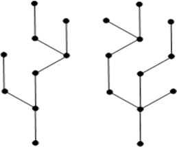

### Rose Trees

- Instead of having zero-branching (as ```Empty```) and binary branching (as ```Fork```) as in binary trees, we can branch any number of times, including zero, one, two, three...

```haskell
data Rose a = Branch a [Rose a]
```
- For example, the ```size``` of a rose tree can be defined as follows, so that it is always a positive number:

```haskell
rsize :: Rose a -> Integer
rsize (Branch _ ts) = 1 + sum [rsize t | t <- ts]
```
- The ```height``` can be defined as follows:
```haskell
rheight :: Rose a -> Integer
rheight (Branch _ []) = 0
rheight (Branch _ ts) = 1 + maximum [rheight t | t <- ts]
```
### Forests


- In graph theory, a ```forest``` is an ```undirected, disconnected, acyclic graph.``` 
- In other words, a disjoint collection of trees is known as forest. Each component of a forest is a tree.



### Expression/Parse Trees

- Many compilers parse strings into expression trees and then process them to generate code.
```haskell
data Expr a = Value a | FromInteger Integer | Negate (Expr a) | Abs (Expr a) | SigNum (Expr a) | Add (Expr a) (Expr a) | Mul (Expr a) (Expr a)
```
- ```Evaluation function``` that processes expression trees to produce values.
```haskell
eval :: Num a => Expr a -> a
eval (Value x)       = x
eval (FromInteger n) = fromInteger n
eval (Negate e)      = negate (eval e)
eval (Abs e)         = abs(eval e)
eval (SigNum e)      = signum(eval e)
eval (Add e e')      = eval e + eval e'
eval (Mul e e')      = eval e * eval e'
```
- Before considering an example, this time let's define our own show function instead of asking Haskell to do this with the deriving mechanism. To a first approximation, the class ```Show``` is defined as follows in the prelude:
```haskell
class Show a where
  show :: a -> String
```
- We define our show function for ```expression trees``` like so:
```haskell
instance Show a => Show(Expr a) where
  show (Value x)       = show x
  show (FromInteger n) = "fromInteger(" ++ show n ++ ")"
  show (Negate e)      = "negate(" ++ show e  ++ ")"
  show (Abs e)         = "abs(" ++ show e ++ ")"
  show (SigNum e)      = "signum(" ++ show e ++ ")"
  show (Add e e')      = "(" ++ show e ++ "+" ++ show e' ++ ")"
  show (Mul e e')      = "(" ++ show e ++ "*" ++ show e' ++ ")"
```
- Running examples...
```haskell
*Main> eval (Mul (Value 3) (Add (Value 7) (Value 6)))
39
*Main> Mul (Value 3) (Add (Value 7) (Value 6))
(3*(7+6))
*Main> show (Mul (Value 3) (Add (Value 7) (Value 6)))
"(3*(7+6))"
```