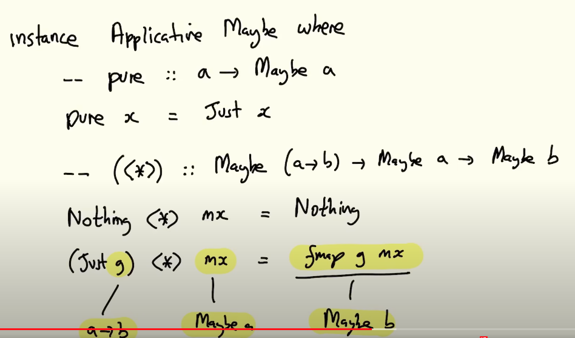

### The List Monad
- The type of lists can be made into a functor by simply defining fmap to be the function map:
```haskell
instance Functor [] where
  -- fmap :: (a -> b) -> [a] -> [b]
  fmap = map
```
- The list type has an instance in the Applicative class, defined as follows:
```haskell
instance Applicative [] where
 --pure :: a -> [a]. Transforms a value into a singleton list
 pure x = [x]
 --(<*>) :: [a -> b] -> [a] -> [b]
 gs <*> xs = [ g x | g <- gs, x <- xs]
```
- ```<*>``` takes a list of functions and a list of arguments, and applies each function to each argument in turn, returning all the results in a list. For example:
```haskell
gs = [f, g, h], xs = [1,2]
gs <*> xs = [f(1), f(2), g(1), g(2), h(1), h(2)]
```
- The following applies the functions "add one" and "multiply by 10" to the list of numbers from 1 to 5.
```haskell
*Main> [(+1),(*10)] <*> [1..5]
[2,3,4,5,6,10,20,30,40,50]
```
- Examples...
```haskell
ghci> pure (+1) <*> [1,2,3] 
[2,3,4]
<ghci> pure (+) <*> [1] <*> [2] 
[3]
```
### The Maybe Monad
- It is straightforward to make the ```Maybe``` type into a ```functor``` by defining a function ```fmap``` of the appropriate type, as follows:
```haskell
instance Functor Maybe where
  -- fmap :: (a -> b) -> Maybe a -> Maybe b 
  fmap _ Nothing = Nothing
  fmap g (Just x) = Just (g x)
```
- Running examples...
```haskell
ghci> fmap (+1) Nothing 
Nothing
ghci> fmap (*2) (Just 3) 
Just 6
```
#### Maybe Instance



- Using the fact that ```Maybe``` is a ```functor``` and hence supports fmap, it is straightforward to make this type into an applicative functor:
```haskell
instance Applicative Maybe where 
  --pure :: a -> Maybe a
  pure x = Just x 
  --(<*>) :: Maybe (a -> b) -> Maybe a -> Maybe b
  Nothing <*> _ = Nothing 
  (Just g) <*> mx = fmap g mx 
```
- Examples
```haskell
ghci> pure (+1) <*> Just 1
Just 2
ghci> pure (+) <*> Just 1 <*> Just 2
Just 3
ghci> pure (+) <*> Nothing <*> Just 2
 Nothing
```
### The State Monad

- More abstractly, we have a state, and we can modify the state during the computation. 
-  If we are in a given state, we want to produce a result and  a new state. 
- - This can be achieved with a transition function ```T```.
```haskell
data State' s a = T (s -> (a,s))
```
- The ```destructor``` (the function opposite to the ```constructor T```) is traditionally called ```runState```:
```haskell
runState' :: State' s a -> (s -> (a, s))
runState' (T p) = p
```
- The definition for a ```State Monad``` is as follows:

```haskell
instance Monad (State' s) where
  -- (>>=) :: State' s a -> (a -> State' s b) -> State' s b
  xm >>= f = case xm of -- xm :: State' s a 
               T p -> T (\u -> case p u of
                                (x, v) -> case f x of
                                            T q -> q v)
  return x = T (\u -> (x,u))
```
- We will use letters
  - ```x, y, z``` for values of type ```a```,
  - ```u, v, w``` for states of type ```s```,
  - ```p, q``` for transition functions of type ```s -> (a,s).```
#### Functor and applicative definitions
```haskell
instance Functor (State' s) where
  fmap f xm = do -- xm :: State' s a 
    x <- xm
    return (f x)

instance Applicative (State' s) where
      fm <*> xm = do -- xm :: State' s a 
        f <- fm
        x <- xm
        return (f x)
```
